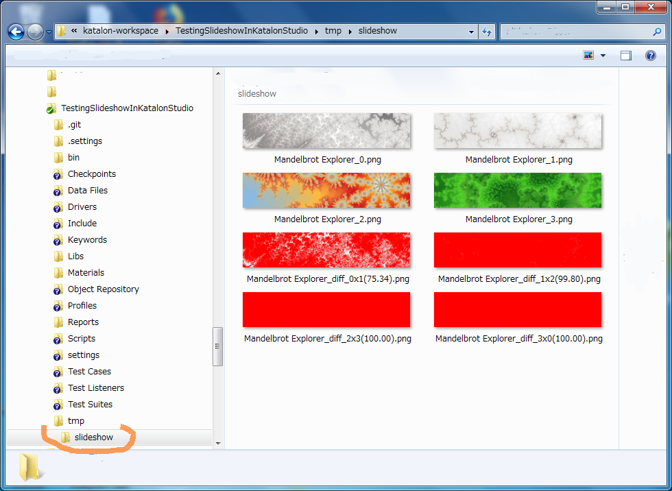
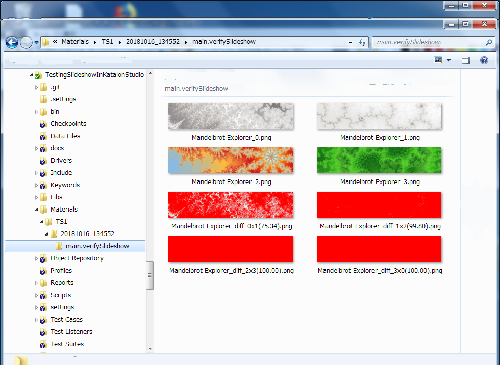
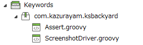

Testing Slideshow in Katalon Studio
=====

## What is this?

This is a [Katalon Studio](https://www.katalon.com/) project for demonstration purpose. You can clone this out to your PC and execute in Katalon Studio.

This project was developed using Katalon Studio 5.7.1.

This project was developed to propose solutions to the following discussion posted in the [Katalon Forum](https://forum.katalon.com/discussions).

1. [Verify Image Present in slideshow](https://forum.katalon.com/discussion/9985/verify-image-present-in-slideshow-)

----

## Problems to solve

Many web sites have slide show in the top page. For example, have a look at this beautiful site: [Mandelbrot Explorer](https://www.mandel.org.uk/). A slide show displays a fixed number of images switched circularly with a fixed intervals in seconds.

I want to verify *if a slide show is in motion*. In other words,

1. I want to take screenshots of each comprising images of a slide show, and save them into file
2. I want to compare pairs of sibling images (img0, img1), (img1, img2), (img2, img3) and (img3, img0) to find out if each pairing images are different or not.
3. I want to specify a criteria number in pecentage (e.g. 70.0%). If a pair of images have larger difference (e.g. 99.0%) then we judge that the pair is different, otherwise we judge the pair is not different enough.
4. If I could find all of the image pairs: (img0, img1), (img1, img2), (img2, img3) and (img3, img0) are different, then I would conclude that the slide show is actually in motion.

## Solution proposed

[aShot](https://github.com/yandex-qatools/ashot), WebDriver Screenshot utility, enables you to take a screenshot of a selected WebElement (e.g. `
`). Also aShot enables you to compare 2 images of the WebElement and let you know how much different they are. This Katalon Studio project uses aShot. It provides a set of Custom Keywords in Katalon Studio, which wrap the [aShot](https://github.com/yandex-qatools/ashot) API. Also the project provides an example Test Case which shows how to make use of the keywords.

You have another related problem. If you run a test which takes screen shots, you would inevitably want to save images into files on your local disk. But how you mange the paths of generated files? My [Materials](https://github.com/kazurayam/Materials) project provides a smart solution for managing & resolving paths of image files.

## Demonstration

### Input

The demo will open [Mandelbrot Explorer](https://www.mandel.org.uk/) and verify if its slide show in the banner is in motion or not.

### How to run the demo

1. download the ZIP file of this demo project from the [releases] Page
2. unzip it
3. start your Katalon Studio, open the project
4. Open `Test Cases/verify-slideshow-example` and run it. You can choose any browser.
5. Or you open `Test Suites/TS1` and run it. You can choose any browser. You apply the `default` Profile, which is the sole profile provided.  

### Output

#### Output from `verify-slideshow-example`

Running the `Test Cases/vefiry-slideshow-example` will result a new folder under the project directory: `./tmp/slideshow`.

In the folder you will find 4 screenshots of the original images. These are taken with 6 seconds of interval.
- `Mandelbrot Explorer_0.png` 
- `Mandelbrot Explorer_1.png` 
- `Mandelbrot Explorer_2.png` 
- `Mandelbrot Explorer_3.png` 

Also in the same folder you fill find 4 comparison result of the original images:
- img0 and img1 comparison (75.34% of difference)
- img1 and img2 comparison (99.80% of difference) 
- img2 and img3 comparison (100% of difference) 
- img3 and img0 comparison (100% of difference) 

I set 70.0% as the criteria. The 4 comparison results has differece of 75.34%, 99.80%, 100.00% and 100.00% --- these are greater than the criteria of 70.0%; 4 images are all different. Therefore the test case PASSES.

### Output from the `Test Suites/TS1`

Running the `Test Suites/TS1` will result a new folder under the project directory: `./Materials/TS1/yyyyMMdd_hhmmss/main.verifySlideshow`.

Description of the folder path:
- `Materials` : fixed name
- `TS1` : the test suite name
- `yyyyMMdd_hhmmss` : the timestamp when the Test Suite was invoked.
- `main.verifySlideshow`: the test case name, derived from the test case id `Test Cases/main/verifySlideshow`

Please note that the path includes the timestamp. This enables you to retain the result of Test Suite's run chronologically; not overwriting the previous results. This chronological format of folder tree makes your testing exercises much easier than working on a `./tmp` folder.

This chronological format is a  mimic of the `Reports` folder of a Katalon Stduio project.

The image files are just the same as the files created by the test case `verify-slideshow-example` above.

## Code description

Custom keywords:

- [`com.kazurayam.ksbackyard.ScreenshotDriver](Keywords/com/kazurayam/ksbackyard/ScreenshotDriver.groovy)
- [`com.kazurayam.ksbackyard.Assert`](Keywords/com/kazurayam/ksbackyard/Assert.groovy)

Test Listener

- [Test Listeners/TL](Test%20Listeners/TL.groovy)

Test Case:

- [`Test Cases/verify-slideshow-example`](Scripts/verify-slideshow-example/Scirpt1539662348280.groovy)
- [`Test Cases/main/verifySlideshow`](Scripts/main/verifySlideshow/Script1539664567499.groovy)

## Step by step instruction to recreate your slide show test

If you want to create a new Katalon Studio project which verifies a slideshow on your target URL, please do as follows:

1. create a new Katalon Studio for you
2. import the jar file of aShot into the project. see the Katalon document [How to import external library into your automation project ](https://docs.katalon.com/katalon-studio/tutorials/import_java_library.html). The jar of aShot is [here](https://mvnrepository.com/artifact/ru.yandex.qatools.ashot/ashot/1.5.4). Or you can reuse the ashot-x.x.x.jar bundled in the demo project's  `./Drivers` folder.
3. import the jar file of Materials. The jar file is donwloadable at [Releases](https://github.com/kazurayam/Materials/releases) page. Or you can reuse the Materials-x.x.x.jar bundled in the demo project's `./Drivers` folder.
4. create `com.kazurayam.ksbackyard.Assert` and `com.kazurayam.ksbackyard.ScreenshotDriver`. Copy the Groovy source from the demo project into your replication. You do not have to modify the source of 2 keywords. 
5. create `Test Listeners/TL`. Copy the Groovy source from the demo project into your replication. You do not have to modify the source.

## Thanks

Special thanks to [Mandelbrot Explorer](https://www.mandel.org.uk/). I picked up this as an example of web site with slide show. I found it in the page of Drupal Module [Views Slideshow](https://www.drupal.org/project/views_slideshow).
